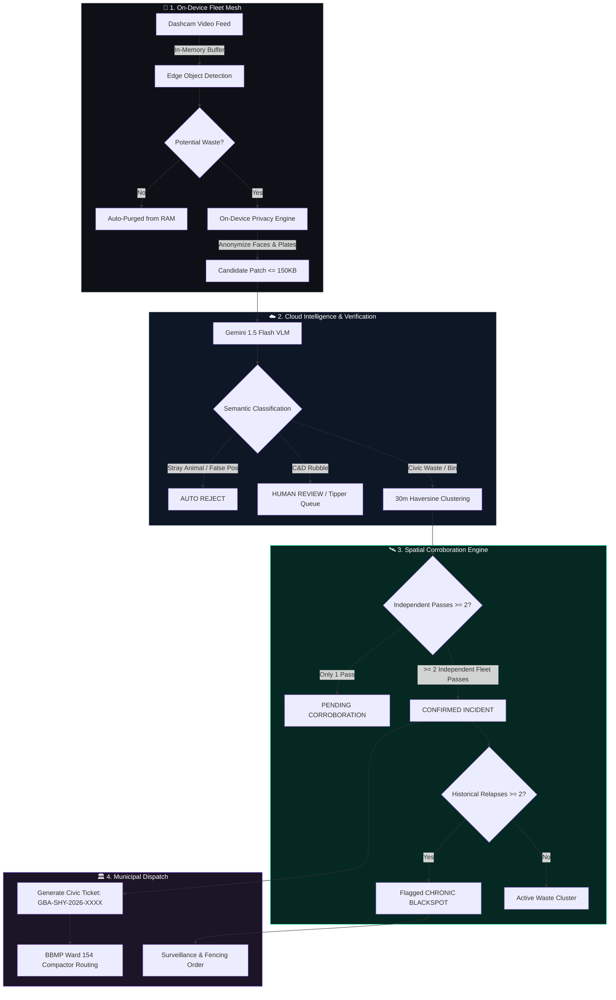

<p align="center">
  
  
  
  
  
  <a href="docs/Kasa_Edge_Hackathon_Presentation.pptx"></a>
  
  
</p>

<h1 align="center">🌿 KASA.EDGE</h1>
<h3 align="center">Passive Urban-Waste Sensing & Autonomous Civic-Triage Platform</h3>

<p align="center">
  <em>"Don't force citizens to report garbage. Let the city observe itself."</em>
</p>

<p align="center">
  <b>Transforming gig-economy delivery fleets into a decentralized, real-time civic observation mesh for the Greater Bengaluru Authority (BBMP / GBA).</b>
</p>

<p align="center">
  <a href="#-the-paradigm-shift">Problem & Solution</a> •
  <a href="#-system-architecture">Architecture</a> •
  <a href="#-5-stage-pipeline">5-Stage Pipeline</a> •
  <a href="#-two-tiered-verification-matrix">Triage Matrix</a> •
  <a href="#-interactive-dashboard--simulator">Simulator Guide</a> •
  <a href="#-quickstart-in-60-seconds">Quickstart</a> •
  <a href="#-api-reference">API Reference</a> •
  <a href="docs/Kasa_Edge_Hackathon_Presentation.pptx">📊 <b>Pitch Deck (.pptx)</b></a>
</p>

---

## 💡 The Paradigm Shift

Traditional civic grievance portals (**Sahaaya, CPGRAMS**) fail because they rely on **active citizen reporting**:
- 🛑 **Friction**: Citizens must stop, take photos, write descriptions, and tag coordinates.
- 🔁 **Duplicates**: 50 people complain about the same pile on 100 Feet Road, clogging call centers.
- 🌫️ **Coverage Blindspots**: Wealthier wards file hundreds of tickets; underserved neighborhoods remain invisible.

```
[ Traditional Model ] Citizen Discovers ➔ Stops & Snaps ➔ Geotags ➔ Submits Form ➔ Manual Triage (Days)
[ Kasa.Edge Model   ] Vehicle Passes ➔ Edge AI Detects ➔ Cloud VLM Corroborates ➔ Auto-Dispatched (< 30 Mins)
```

**Kasa.Edge** turns existing municipal and gig-economy vehicles (delivery riders, couriers, auto-rickshaws, cabs) into a **continuous, passive urban sensing mesh** that operates seamlessly in the background without driver intervention.

---

## 🏗️ System Architecture



---

## ⚡ Key System Capabilities

| Pillar | Capability | Technical Guarantee |
| :--- | :--- | :--- |
| 🔒 **Zero-Stream Privacy** | On-device face and license plate redaction. | Raw continuous video **never leaves the vehicle**; only redacted crops $\le 150\text{ KB}$ are transmitted. |
| 🛰️ **Spatial Corroboration** | 30-meter Haversine incident clustering. | Eliminates duplicate tickets by aggregating multi-pass observations into single geographical incident clusters. |
| 🤖 **Multimodal Semantic Triage** | Gemini 1.5 Flash Vision-Language Model. | Differentiates roadside garbage from sleeping animals, foliage, parked carts, and construction rubble. |
| 🛡️ **Anti-Spurious Dispatch** | Deterministic 2-pass vehicle policy. | Prevents false dispatches by requiring **$\ge 2$ independent vehicles** before triggering official municipal work orders. |
| 📈 **Blackspot Intelligence** | Chronic recurrence tracking. | Automatically upgrades recurring dump sites ($\ge 2$ clean-and-relapse cycles) into **Monitored Civic Blackspots**. |

---

## 🛡️ Two-Tiered Verification & Triage Matrix

```
       [ Candidate Crop Received ]
                    │
            ┌───────┴───────┐
            │               │
     [Edge Confidence] [VLM Semantic Analysis]
            │               │
            ▼               ▼
┌───────────────────────┬──────────────┬───────────────────┬──────────────────────────────────────────┐
│ Scene Classification  │ Category     │ Triage Action     │ Municipal Rationale                      │
├───────────────────────┼──────────────┼───────────────────┼──────────────────────────────────────────┤
│ 🐕 Stray Animal       │ animal       │ ❌ REJECT         │ Non-waste fauna; eliminates false alarms │
│ 🧱 C&D Debris         │ construction │ ⚠️ HUMAN REVIEW  │ Tipper truck required, not sweepers      │
│ 🗑️ Roadside Garbage   │ mixed_waste  │ ⏳ CORROBORATE    │ Awaits second pass before compactor dispatch│
│ 📦 Overflowing Bin    │ overflowing  │ 🚨 CONFIRM (URGENT)│ Public container breach; immediate dispatch│
└───────────────────────┴──────────────┴───────────────────┴──────────────────────────────────────────┘
```

---

## 🎮 Interactive Dashboard & Simulator

Kasa.Edge includes an interactive, dark-mode civic command center built with **Tailwind CSS**, **Leaflet GIS**, and **Chart.js**.

<div align="center">
  <kbd>
    
    
  </kbd>
</div>

### Built-in 6-Step Fleet Simulation Flow:
1. **Pass 1 (`Rider R-01`)**: Spots curbside garbage on 100 Feet Road. Status set to `PENDING_CORROBORATION` (awaiting second pass).
2. **Pass 2 (`Courier R-02`)**: 22 minutes later, independent vehicle passes 10m away. Spatial match confirmed! Upgrades to `CONFIRMED`, persistence reaches 60, and ticket `GBA-SHY-2026-4401` is generated.
3. **Pass 3 (`Cab R-03`)**: Dashcam captures a sleeping street dog on CMH Road. VLM classifies as `animal` and deterministic policy rejects it (false-positive suppression).
4. **Pass 4 (`Rider R-01`)**: Detects concrete rubble and cement bags. Routed to `HUMAN_REVIEW` queue for specialized C&D machinery.
5. **Pass 5 (`Courier R-02`)**: Detects an overflowing commercial bin. Tagged `CONFIRMED` with `URGENT` priority.
6. **Pass 6 (`Cab R-03`)**: New dump detected at an older cleared site. Spatial engine detects recurrence ($\ge 2$) and flags a **Chronic Relapse Blackspot**!

---

## 🚀 Quickstart in 60 Seconds

### Prerequisites
- Python 3.9+ installed
- macOS, Linux, or WSL2

### 1. Clone the Repository
```bash
git clone https://github.com/17puskarkartik18-lgtm/kasa-edge.git
cd kasa-edge
```

### 2. Configure Environment (Optional)
```bash
cp .env.example .env
# Edit .env to add your GEMINI_API_KEY (optional)
```

### 3. Launch Platform
```bash
chmod +x run.sh
./run.sh
```

Open your browser to: **[http://localhost:8000](http://localhost:8000)**

---

## 🧪 Testing & Verification

Run the automated API and spatial verification test suite:

```bash
# Run unit tests
PYTHONPATH=. python3 -m unittest discover tests

# Or run specific test case
PYTHONPATH=. python3 -m unittest tests/test_api.py
```

---

## 📡 API Specification

| Method | Endpoint | Description |
| :--- | :--- | :--- |
| `GET` | `/` | Web GIS Command Center Dashboard |
| `GET` | `/stats` | Aggregated civic KPIs (incidents, tickets, blackspots, vehicles) |
| `POST` | `/observation` | Ingests on-device candidate patch with GPS, runs VLM & clustering |
| `GET` | `/incidents` | Lists active spatial incident clusters with multi-vehicle proof |
| `GET` | `/incidents/{id}` | Detailed incident timeline and corroborating observation passes |
| `GET` | `/blackspots` | Chronic recurring dump locations requiring enforcement |
| `GET` | `/tickets` | Dispatched GBA/BBMP compactor work orders |
| `POST` | `/simulator/step` | Advance the automated fleet simulator by 1 pass |
| `POST` | `/simulator/run_all`| Execute the complete 6-stage lifecycle simulation |
| `POST` | `/simulator/reset`| Reset database to pristine demo state |
| `GET` | `/gazetteer` | Ward 154 arterial corridor breakdown and telemetry |

---

## 📦 Tech Stack

- **Backend & API**: Python 3.9+, [FastAPI](https://fastapi.tiangolo.com/), Uvicorn
- **Spatial Clustering**: Haversine Spherical Distance Algorithm ($R=6371\text{ km}$)
- **Vision-Language Model**: Google Gemini 1.5 Flash (with deterministic heuristic fallback)
- **Frontend & GIS**: HTML5, Vanilla JavaScript, [Tailwind CSS](https://tailwindcss.com/), [Leaflet.js](https://leafletjs.com/), [Chart.js](https://www.chartjs.org/)
- **Data Persistence**: SQLite 3 with spatial indexing and JSON schema enforcement
- **Privacy & Image Processing**: OpenCV, Pillow (PIL), NumPy

---

## 🤝 Contributing

Contributions, feedback, and civic tech partnerships are warmly welcomed!
1. Fork the Project
2. Create your Feature Branch (`git checkout -b feature/AmazingFeature`)
3. Commit your Changes (`git commit -m 'Add some AmazingFeature'`)
4. Push to the Branch (`git push origin feature/AmazingFeature`)
5. Open a Pull Request

---

## 📄 License

Distributed under the **MIT License**. See [`LICENSE`](file:///Users/kartikpushkar/my-project/LICENSE) for more information.

<p align="center">
  <b>Built with ❤️ for cleaner, self-sensing cities.</b>
</p>
